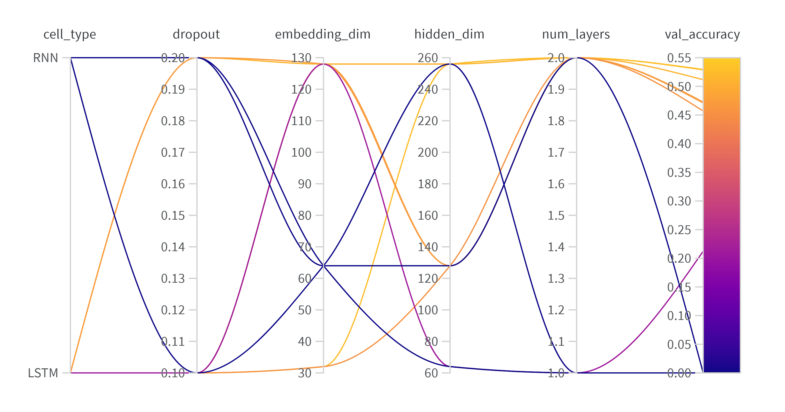
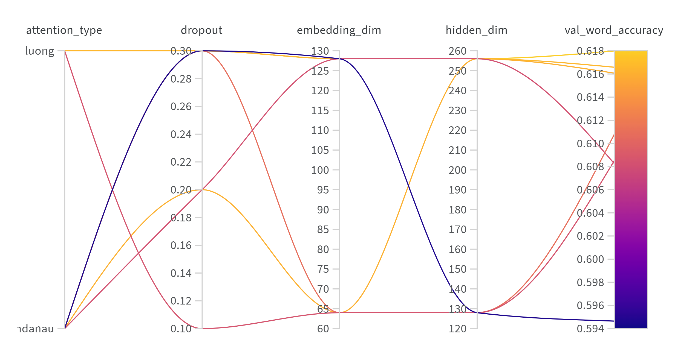
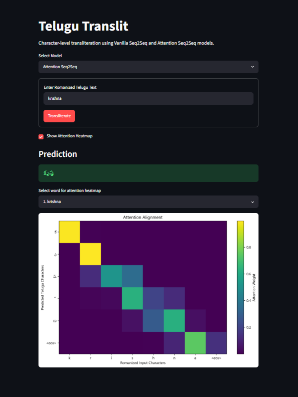

# TeluguTranslit

> A character-level neural transliteration system for converting Romanized Telugu text into Telugu script using Vanilla Seq2Seq and Attention-based Seq2Seq architectures implemented from scratch in PyTorch.

TeluguTranslit compares a recurrent encoder-decoder baseline against an attention-based architecture, performs progressive hyperparameter optimization using Weights & Biases Bayesian sweeps, evaluates models using sequence-level and character-level metrics, visualizes learned attention alignments, and provides an interactive Streamlit application for inference.

---

## Overview

Transliteration converts text between writing systems while preserving pronunciation.

For example:

```text
Romanized Telugu: amma
Telugu Script:    అమ్మ
```

Unlike translation, the objective is not to change the language or meaning of the input. The model learns character-level mappings from Romanized Telugu sequences to Telugu Unicode characters.

This project implements and compares two architectures:

### Vanilla Seq2Seq

* Character embeddings
* Recurrent encoder-decoder architecture
* Configurable RNN, GRU, and LSTM cells
* Multi-layer recurrent networks
* Teacher forcing during training
* Greedy autoregressive decoding during inference

### Attention Seq2Seq

* Bidirectional recurrent encoder
* Bahdanau additive attention
* Luong multiplicative attention support
* Source padding masks
* Context-aware autoregressive decoding
* Attention alignment visualization

The models are trained and evaluated on the Telugu transliteration lexicons from the Dakshina Dataset.

---

## Results

Evaluation is performed on the held-out test set using greedy autoregressive decoding without teacher forcing.

| Model             | Exact Word Accuracy | Positional Character Accuracy | Character Error Rate |
| ----------------- | ------------------: | ----------------------------: | -------------------: |
| Vanilla Seq2Seq   |              58.29% |                        85.02% |               0.0938 |
| Attention Seq2Seq |          **62.90%** |                    **88.03%** |           **0.0750** |

The attention-based model improves over the vanilla baseline by:

* **+4.61 percentage points** in exact word accuracy
* **+3.01 percentage points** in positional character accuracy
* **20.04% relative reduction** in Character Error Rate

These results show that allowing the decoder to dynamically attend to encoder states improves character alignment and transliteration performance compared with compressing the complete source sequence into a single fixed-size hidden representation.

---

## Model Architecture

### Vanilla Seq2Seq

```text
Romanized Characters
        │
        ▼
Character Embedding
        │
        ▼
Recurrent Encoder
        │
        ▼
Final Hidden State
        │
        ▼
Recurrent Decoder
        │
        ▼
Linear Projection
        │
        ▼
Telugu Character Sequence
```

The vanilla architecture encodes the complete input sequence into the encoder's final hidden state. The decoder then generates Telugu characters autoregressively.

### Attention Seq2Seq

```text
Romanized Characters
        │
        ▼
Character Embedding
        │
        ▼
Bidirectional Encoder
        │
        ├──────────────────────┐
        │                      │
        ▼                      ▼
Encoder Hidden States     Decoder State
        │                      │
        └────── Attention ─────┘
                   │
                   ▼
             Context Vector
                   │
                   ▼
            Recurrent Decoder
                   │
                   ▼
            Telugu Character
```

Instead of relying only on the final encoder state, the attention model computes a weighted combination of encoder outputs at every decoding step.

The implementation supports:

* **Bahdanau Attention** — additive attention computed before the recurrent decoder update.
* **Luong Attention** — multiplicative attention computed using the current decoder state.

---

## Hyperparameter Optimization

Weights & Biases Bayesian sweeps were used to explore model configurations.

Hyperparameter optimization was performed progressively. The Vanilla Seq2Seq model was first evaluated over a broad architecture search space. A second sweep then refined the search toward stronger recurrent configurations and changed the optimization objective to validation word accuracy.

The Attention Seq2Seq model was tuned separately over attention mechanism, model capacity, and dropout.

### Vanilla Seq2Seq — Initial Sweep

| Hyperparameter          | Values              |
| ----------------------- | ------------------- |
| Optimization Method     | Bayesian Search     |
| Optimization Metric     | Validation Accuracy |
| Cell Type               | RNN, GRU, LSTM      |
| Embedding Dimension     | 32, 64, 128         |
| Hidden Dimension        | 64, 128, 256        |
| Number of Layers        | 1, 2                |
| Dropout                 | 0.1, 0.2            |
| Training Epochs per Run | 5                   |

The initial sweep broadly explored recurrent cell type, network depth, embedding dimension, hidden dimension, and dropout.

### Vanilla Seq2Seq — Refined Sweep

| Hyperparameter          | Values                   |
| ----------------------- | ------------------------ |
| Optimization Method     | Bayesian Search          |
| Optimization Metric     | Validation Word Accuracy |
| Cell Type               | GRU, LSTM                |
| Embedding Dimension     | 64, 128                  |
| Hidden Dimension        | 256, 512                 |
| Number of Layers        | 2                        |
| Dropout                 | 0.1, 0.2                 |
| Training Epochs per Run | 5                        |

Based on the initial experiments, the search space was narrowed toward stronger recurrent cells, deeper representations, and larger hidden dimensions.



### Attention Seq2Seq Sweep

| Hyperparameter          | Values                   |
| ----------------------- | ------------------------ |
| Optimization Method     | Bayesian Search          |
| Optimization Metric     | Validation Word Accuracy |
| Cell Type               | LSTM                     |
| Attention Type          | Bahdanau, Luong          |
| Embedding Dimension     | 64, 128                  |
| Hidden Dimension        | 128, 256                 |
| Number of Layers        | 2                        |
| Dropout                 | 0.1, 0.2, 0.3            |
| Training Epochs per Run | 10                       |

The attention sweep compared Bahdanau and Luong attention mechanisms while exploring model capacity and regularization settings.



---

## Final Model Configurations

After hyperparameter optimization, the selected configurations were trained for longer durations with early stopping and best-checkpoint selection based on validation word accuracy.

### Vanilla Seq2Seq

| Hyperparameter        | Selected Value |
| --------------------- | -------------- |
| Embedding Dimension   | 64             |
| Hidden Dimension      | 512            |
| Cell Type             | LSTM           |
| Number of Layers      | 2              |
| Dropout               | 0.2            |
| Learning Rate         | 0.001          |
| Teacher Forcing Ratio | 0.5            |

### Attention Seq2Seq

| Hyperparameter        | Selected Value |
| --------------------- | -------------- |
| Embedding Dimension   | 128            |
| Hidden Dimension      | 256            |
| Cell Type             | LSTM           |
| Attention Type        | Bahdanau       |
| Number of Layers      | 2              |
| Dropout               | 0.3            |
| Learning Rate         | 0.001          |
| Weight Decay          | 1e-5           |
| Teacher Forcing Ratio | 0.5            |

Final training additionally used gradient clipping, learning-rate scheduling, early stopping, and best-checkpoint selection based on validation word accuracy.

---

## Attention Visualization

The attention model exposes the alignment weights generated during autoregressive decoding.

Attention heatmaps show how each predicted Telugu character distributes attention across Romanized input characters.

```text
Input Characters
       │
       ▼
┌───────────────────────────┐
│                           │
│     Attention Matrix      │
│                           │
└───────────────────────────┘
       ▲
       │
Predicted Telugu Characters
```

Generate attention heatmaps using:

```bash
python visualize_attention.py
```

Generated visualizations are stored in:

```text
attention_heatmaps/
```

---

## Interactive Streamlit Demo

The project includes a Streamlit application for interactive inference.

Features include:

* Romanized Telugu sentence input
* Vanilla and Attention model selection
* Word-by-word transliteration
* Greedy autoregressive decoding
* Interactive attention heatmaps
* Selection of individual words for attention inspection
* Cached model loading for efficient inference

### Application Preview


Run the application with:

```bash
streamlit run app.py
```

---

## Evaluation Metrics

Three metrics are used for test-set evaluation.

### Exact Word Accuracy

Measures the percentage of predicted words that exactly match the target word.

```text
prediction == target
```

This is the strictest evaluation metric.

### Positional Character Accuracy

Measures the number of characters correctly predicted at corresponding positions, normalized by the total number of target characters.

### Character Error Rate

Character Error Rate is computed using Levenshtein distance:

```text
CER = Total Character Edit Distance / Total Target Characters
```

Lower CER indicates better transliteration quality.

---

## Training Pipeline

```text
Dakshina Dataset
        │
        ▼
Character Tokenization
        │
        ▼
Train / Validation / Test Sets
        │
        ▼
Progressive Hyperparameter Sweeps
        │
        ├── Vanilla Sweep
        │
        └── Attention Sweep
        │
        ▼
Best Configuration Selection
        │
        ▼
Final Model Training
        │
        ▼
Early Stopping + Checkpointing
        │
        ▼
Greedy Autoregressive Inference
        │
        ▼
Test Evaluation
        │
        ├── Exact Word Accuracy
        ├── Positional Character Accuracy
        └── Character Error Rate
        │
        ▼
Attention Visualization + Streamlit Demo
```

---

## Tech Stack

| Component                                         | Technology                                                               |
| ------------------------------------------------- | ------------------------------------------------------------------------ |
| Language                                          | Python                                                                   |
| Deep Learning Framework                           | PyTorch                                                                  |
| Experiment Tracking & Hyperparameter Optimization | Weights & Biases                                                         |
| Data Processing                                   | Pandas                                                                   |
| Visualization                                     | Matplotlib                                                               |
| Interactive Application                           | Streamlit                                                                |
| Dataset                                           | Dakshina Dataset                                                         |
| Sequence Modeling                                 | RNN, GRU, LSTM                                                           |
| Attention Mechanisms                              | Bahdanau and Luong Attention                                             |
| Evaluation                                        | Exact Word Accuracy, Positional Character Accuracy, Character Error Rate |

---

## Project Structure

```text
transliteration_seq2seq/
│
├── models/
│   ├── __init__.py
│   ├── vanilla_seq2seq.py
│   └── attention_seq2seq.py
│
├── utils/
│   ├── __init__.py
│   ├── dataset.py
│   ├── inference.py
│   └── metrics.py
│
├── data/
│   └── dakshina_dataset_v1.0/
│
├── assets/
│   ├── vanilla_sweep_2.png
│   ├── attention_sweep.png
│   └── streamlit_demo.png
│
├── attention_heatmaps/
│
├── predictions_vanilla/
├── predictions_attention/
│
├── vanilla_sweep_train.py
├── vanilla_final_train.py
├── attention_sweep_train.py
├── attention_final_train.py
│
├── evaluate.py
├── visualize_attention.py
├── app.py
│
├── requirements.txt
├── .gitignore
└── README.md
```

---

## Installation

Clone the repository:

```bash
git clone https://github.com/BVedhashreyan/telugu-transliteration-seq2seq
cd transliteration_seq2seq
```

Create and activate a virtual environment:

```bash
python -m venv venv
```

**Windows**

```bash
venv\Scripts\activate
```

**Linux / macOS**

```bash
source venv/bin/activate
```

Install dependencies:

```bash
pip install -r requirements.txt
```

---

## Usage

### Train the Vanilla Seq2Seq Model

Run hyperparameter sweeps:

```bash
python vanilla_sweep_train.py
```

Train the final selected configuration:

```bash
python vanilla_final_train.py
```

### Train the Attention Seq2Seq Model

Run the hyperparameter sweep:

```bash
python attention_sweep_train.py
```

Train the final selected configuration:

```bash
python attention_final_train.py
```

### Evaluate Models

```bash
python evaluate.py
```

### Generate Attention Heatmaps

```bash
python visualize_attention.py
```

### Launch the Demo

```bash
streamlit run app.py
```

---

## Key Engineering Features

* Character-level sequence modeling implemented from scratch in PyTorch
* Configurable RNN, GRU, and LSTM architectures
* Vanilla encoder-decoder baseline
* Bidirectional attention encoder
* Bahdanau and Luong attention mechanisms
* Teacher forcing during training
* Greedy autoregressive inference independent of target sequences
* Padding-aware attention masking
* Gradient clipping
* Learning-rate scheduling
* Early stopping and model checkpointing
* Progressive Bayesian hyperparameter optimization with Weights & Biases
* Exact-match, character-level, and edit-distance evaluation
* Attention alignment visualization
* Interactive Streamlit inference application

---

## Limitations

* The model operates at the character level and may struggle with rare or ambiguous phonetic spellings.
* Greedy decoding can produce suboptimal sequences compared with beam search or other sequence-level decoding strategies.
* The training data consists primarily of isolated word pairs, while sentence-level contextual information is not modeled.
* Transliteration performance depends on the Romanization patterns represented in the training dataset.
* Positional character accuracy does not account for shifted alignments and is therefore reported alongside the more robust Character Error Rate.

---

## Future Work

Potential improvements include:

* Beam search decoding
* Sentence-level transliteration with contextual modeling
* Transformer-based encoder-decoder architecture
* Coverage-aware or multi-head attention mechanisms
* Error analysis grouped by word length and character patterns
* Comparison with pretrained multilingual sequence-to-sequence models
* Deployment of the Streamlit application as a public demo

---

## Dataset

This project uses the Telugu transliteration lexicons from the **Dakshina Dataset**, which contains native-script text and corresponding Romanized transliterations for South Asian languages.

---

## Author

**Vedhashreyan Brahmadevara**

B.Tech Robotics and Automation, 
National Institute of Technology Kurukshetra

---

## Acknowledgements

* Dakshina Dataset for Telugu transliteration data
* PyTorch for deep learning infrastructure
* Weights & Biases for experiment tracking and hyperparameter optimization
* Streamlit for the interactive inference interface
